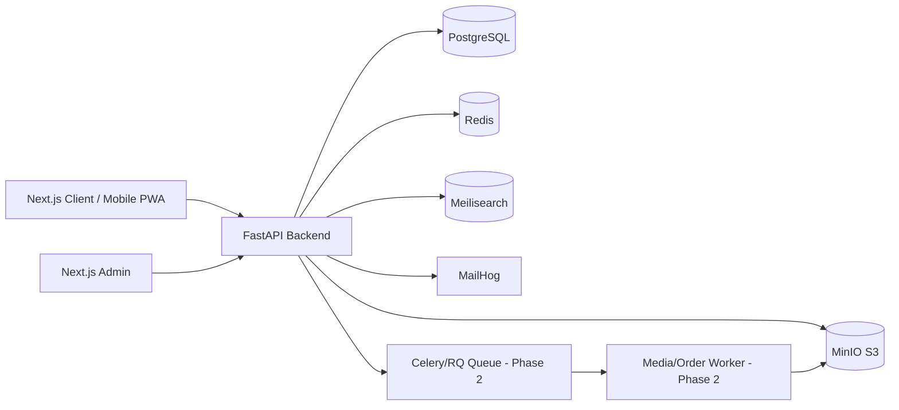

# Grace Young Phase 1 Architecture

## Phase 1 Decisions

- **Modular monolith backend:** faster MVP delivery, cleaner migration path to services later.
- **PostgreSQL + Alembic:** schema versioning from day one.
- **MinIO first:** local S3-compatible development; later swap to AWS S3/R2 via storage adapter.
- **Meilisearch first:** simple local product search; later OpenSearch if needed.
- **Redis:** cache, carts, sessions, and queue broker candidate.
- **Next.js client/admin:** shared design system later; independent deploy targets.

## Next Phase

1. Product CRUD API and Admin UI.
2. MinIO image upload adapter.
3. Seed catalog for skin concerns and K-beauty categories.
4. Queue worker for media and webhook jobs.
5. Cart/order/payment skeleton.
