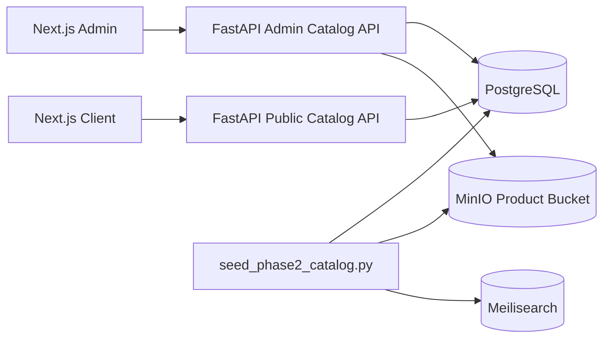

# Grace Young Phase 2 Architecture

Phase 2 adds catalog CRUD and local media workflows to the Phase 1 infrastructure.

## Scope

- Category CRUD
- Brand CRUD
- Product CRUD
- Admin product creation UI
- Product image upload to MinIO
- Seed script that generates 250 sample products and 250 package-style PNG images
- Public catalog product listing API
- Optional Meilisearch indexing

## Local architecture



## Generated sample catalog

The seed creates:

| Entity | Count |
|---|---:|
| Categories | 5 |
| Brands | 25 |
| Products | 250 |
| Product images | 250 |

Category list:

1. Skincare
2. Suncare
3. Face Masks
4. Makeup
5. K-Beauty Devices

Each category has 5 category-specific sample brands. Each brand has 10 products.

## MinIO object layout

```text
grace-young-products/
  sample-products/
    skincare/
    suncare/
    face-masks/
    makeup/
    k-beauty-devices/
  admin-uploads/
```

## API endpoints

### Public

```text
GET /api/v1/catalog/summary
GET /api/v1/catalog/categories
GET /api/v1/catalog/products?limit=24&offset=0&category=skincare
```

### Admin

```text
GET    /api/v1/admin/catalog/categories
POST   /api/v1/admin/catalog/categories
GET    /api/v1/admin/catalog/brands
POST   /api/v1/admin/catalog/brands
GET    /api/v1/admin/catalog/products
POST   /api/v1/admin/catalog/products
GET    /api/v1/admin/catalog/products/{product_id}
PATCH  /api/v1/admin/catalog/products/{product_id}
DELETE /api/v1/admin/catalog/products/{product_id}
POST   /api/v1/admin/catalog/images/upload
```

## Recommended next phase

Phase 3 should add:

- CSV/Excel import center
- Image ZIP import matching by SKU/slug
- Product variants/SKU inventory
- Cart and checkout skeleton
- Order tables and admin order status flow
