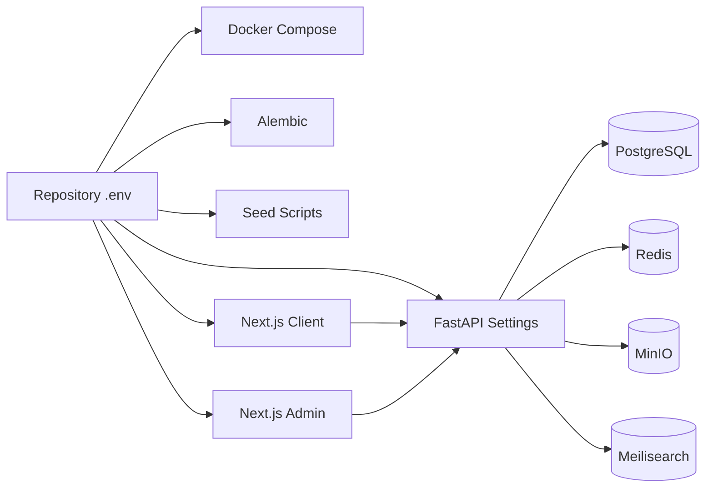

# Phase 4 - Env-Driven Configuration

## Goal

Phase 4 makes the repository-root `.env` the single configuration source for local development.

## Configuration Flow



## Backend

`backend/app/core/config.py` loads:

1. repository-root `.env`
2. `backend/.env`
3. process environment variables

Process environment variables still take precedence.

## Frontend

Next.js does not automatically load the repository-root `.env` when started from `frontend/client` or `frontend/admin`. To solve this, both frontend package scripts run through:

```text
scripts/run-with-root-env.mjs
```

This script searches upward for `.env`, loads it, derives `NEXT_PUBLIC_*` variables where needed, then starts Next.js.

## Safe Debugging

Use:

```text
GET /health/config
```

The endpoint returns non-secret values only, such as origins, buckets, locale, and whether Stripe/PayPal/shipping keys are configured.

## New Env Placeholders

Phase 4 includes placeholders for later integration phases:

- `STRIPE_SECRET_KEY`
- `STRIPE_WEBHOOK_SECRET`
- `PAYPAL_CLIENT_ID`
- `PAYPAL_CLIENT_SECRET`
- `EASYPOST_API_KEY`
- `SHIPPO_API_KEY`
- `QUEUE_BROKER_URL`
- `QUEUE_RESULT_BACKEND`

## Local Override Strategy

Recommended:

- keep shared local values in repository-root `.env`
- use shell-exported variables for temporary overrides
- use `backend/.env` only when backend must differ from root settings

